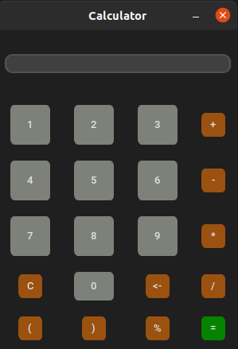

# GUI Calculator

<strong>This is a simple graphical user interface builded with python, using the tkinter library where we can make math operations<strong>

<br/>

<p align="center">
    
<p>

## Requirements

```
pip install -r requirements.txt
```

## Usage

```
make start
```

or if Makefile is not enable

```
python3 main.py
```

## Documentation

- [CustomTkinter](https://github.com/TomSchimansky/CustomTkinter)
- [Tkinter](https://docs.python.org/es/3/library/tkinter.html)
- [Guide Tkinter](https://realpython.com/python-gui-tkinter/)
- [Video Tutorial](https://www.youtube.com/watch?v=0SgC-LBjEjY&ab_channel=CODEROOM)

## Author

- Daniel Duarte
